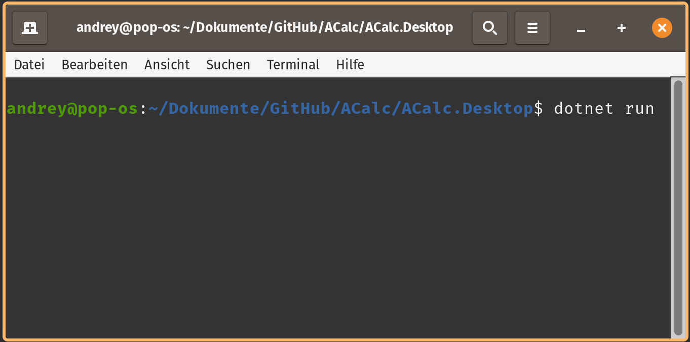

# ACalc
Learning project - Crossplatform Calculator for Android/Desktop developed under Linux using dotnet/Avalonia

### Current Problem:

Attempt to run desktop version


```
andrey@pop-os:~/Dokumente/GitHub/ACalc/ACalc.Desktop$ dotnet run
```
caused exception (Call from invalid thread) on click on every button:



```
Unhandled exception. System.InvalidOperationException: Call from invalid thread
   at Avalonia.Threading.Dispatcher.VerifyAccess() in /_/src/Avalonia.Base/Threading/Dispatcher.cs:line 48
   at Avalonia.AvaloniaObject.GetValue[T](StyledPropertyBase`1 property) in /_/src/Avalonia.Base/AvaloniaObject.cs:line 249
   at Avalonia.Controls.Button.get_CommandParameter() in /_/src/Avalonia.Controls/Button.cs:line 154
   at Avalonia.Controls.Button.CanExecuteChanged(Object sender, EventArgs e) in /_/src/Avalonia.Controls/Button.cs:line 487
   at ReactiveUI.ReactiveCommandBase`2.OnCanExecuteChanged(Boolean newValue) in D:\a\ReactiveUI\ReactiveUI\src\ReactiveUI\ReactiveCommand\ReactiveCommandBase.cs:line 219
   at System.Reactive.AnonymousSafeObserver`1.OnNext(T value) in /_/Rx.NET/Source/src/System.Reactive/AnonymousSafeObserver.cs:line 43
   at System.Reactive.Sink`1.ForwardOnNext(TTarget value) in /_/Rx.NET/Source/src/System.Reactive/Internal/Sink.cs:line 49
   at System.Reactive.IdentitySink`1.OnNext(T value) in /_/Rx.NET/Source/src/System.Reactive/Internal/IdentitySink.cs:line 15
   at System.Reactive.Subjects.FastImmediateObserver`1.EnsureActive(Int32 count) in /_/Rx.NET/Source/src/System.Reactive/Subjects/ReplaySubject.cs:line 863
   at System.Reactive.Subjects.FastImmediateObserver`1.EnsureActive() in /_/Rx.NET/Source/src/System.Reactive/Subjects/ReplaySubject.cs:line 765
   at System.Reactive.Subjects.ReplaySubject`1.ReplayBase.OnNext(T value) in /_/Rx.NET/Source/src/System.Reactive/Subjects/ReplaySubject.cs:line 270
   at System.Reactive.Subjects.ReplaySubject`1.OnNext(T value) in /_/Rx.NET/Source/src/System.Reactive/Subjects/ReplaySubject.cs:line 161
   at System.Reactive.Sink`1.ForwardOnNext(TTarget value) in /_/Rx.NET/Source/src/System.Reactive/Internal/Sink.cs:line 49
   at System.Reactive.IdentitySink`1.OnNext(T value) in /_/Rx.NET/Source/src/System.Reactive/Internal/IdentitySink.cs:line 15
   at System.Reactive.Sink`1.ForwardOnNext(TTarget value) in /_/Rx.NET/Source/src/System.Reactive/Internal/Sink.cs:line 49
   at System.Reactive.Linq.ObservableImpl.DistinctUntilChanged`2._.OnNext(TSource value) in /_/Rx.NET/Source/src/System.Reactive/Linq/Observable/DistinctUntilChanged.cs:line 72
   at System.Reactive.Sink`1.ForwardOnNext(TTarget value) in /_/Rx.NET/Source/src/System.Reactive/Internal/Sink.cs:line 49
   at System.Reactive.Linq.ObservableImpl.CombineLatest`3._.SecondObserver.OnNext(TSecond value) in /_/Rx.NET/Source/src/System.Reactive/Linq/Observable/CombineLatest.cs:line 177
   at System.Reactive.Sink`1.ForwardOnNext(TTarget value) in /_/Rx.NET/Source/src/System.Reactive/Internal/Sink.cs:line 49
   at System.Reactive.IdentitySink`1.OnNext(T value) in /_/Rx.NET/Source/src/System.Reactive/Internal/IdentitySink.cs:line 15
   at System.Reactive.Subjects.FastImmediateObserver`1.EnsureActive(Int32 count) in /_/Rx.NET/Source/src/System.Reactive/Subjects/ReplaySubject.cs:line 863
   at System.Reactive.Subjects.FastImmediateObserver`1.EnsureActive() in /_/Rx.NET/Source/src/System.Reactive/Subjects/ReplaySubject.cs:line 765
   at System.Reactive.Subjects.ReplaySubject`1.ReplayBase.OnNext(T value) in /_/Rx.NET/Source/src/System.Reactive/Subjects/ReplaySubject.cs:line 270
   at System.Reactive.Subjects.ReplaySubject`1.OnNext(T value) in /_/Rx.NET/Source/src/System.Reactive/Subjects/ReplaySubject.cs:line 161
   at System.Reactive.Sink`1.ForwardOnNext(TTarget value) in /_/Rx.NET/Source/src/System.Reactive/Internal/Sink.cs:line 49
   at System.Reactive.IdentitySink`1.OnNext(T value) in /_/Rx.NET/Source/src/System.Reactive/Internal/IdentitySink.cs:line 15
   at System.Reactive.Sink`1.ForwardOnNext(TTarget value) in /_/Rx.NET/Source/src/System.Reactive/Internal/Sink.cs:line 49
   at System.Reactive.Linq.ObservableImpl.DistinctUntilChanged`2._.OnNext(TSource value) in /_/Rx.NET/Source/src/System.Reactive/Linq/Observable/DistinctUntilChanged.cs:line 72
   at System.Reactive.Sink`1.ForwardOnNext(TTarget value) in /_/Rx.NET/Source/src/System.Reactive/Internal/Sink.cs:line 49
   at System.Reactive.IdentitySink`1.OnNext(T value) in /_/Rx.NET/Source/src/System.Reactive/Internal/IdentitySink.cs:line 15
   at System.Reactive.Sink`1.ForwardOnNext(TTarget value) in /_/Rx.NET/Source/src/System.Reactive/Internal/Sink.cs:line 49
   at System.Reactive.Linq.ObservableImpl.Select`2.Selector._.OnNext(TSource value) in /_/Rx.NET/Source/src/System.Reactive/Linq/Observable/Select.cs:line 47
   at System.Reactive.Sink`1.ForwardOnNext(TTarget value) in /_/Rx.NET/Source/src/System.Reactive/Internal/Sink.cs:line 49
   at System.Reactive.Linq.ObservableImpl.Scan`2._.OnNext(TSource value) in /_/Rx.NET/Source/src/System.Reactive/Linq/Observable/Scan.cs:line 48
   at System.Reactive.SafeObserver`1.WrappingSafeObserver.OnNext(TSource value) in /_/Rx.NET/Source/src/System.Reactive/Internal/SafeObserver.cs:line 30
   at System.Reactive.ObserveOnObserverLongRunning`1.Drain() in /_/Rx.NET/Source/src/System.Reactive/Internal/ScheduledObserver.cs:line 732
   at System.Reactive.ObserveOnObserverLongRunning`1.<>c.<.cctor>b__17_0(ObserveOnObserverLongRunning`1 self, ICancelable cancelable) in /_/Rx.NET/Source/src/System.Reactive/Internal/ScheduledObserver.cs:line 680
   at System.Reactive.Concurrency.DefaultScheduler.LongRunning.LongScheduledWorkItem`1.<>c.<.ctor>b__3_0(Object thisObject) in /_/Rx.NET/Source/src/System.Reactive/Concurrency/DefaultScheduler.cs:line 181
   at System.Reactive.Concurrency.ConcurrencyAbstractionLayerImpl.<>c.<StartThread>b__8_0(Object itemObject) in /_/Rx.NET/Source/src/System.Reactive/Concurrency/ConcurrencyAbstractionLayerImpl.cs:line 75
   at System.Threading.Thread.StartCallback()
```
